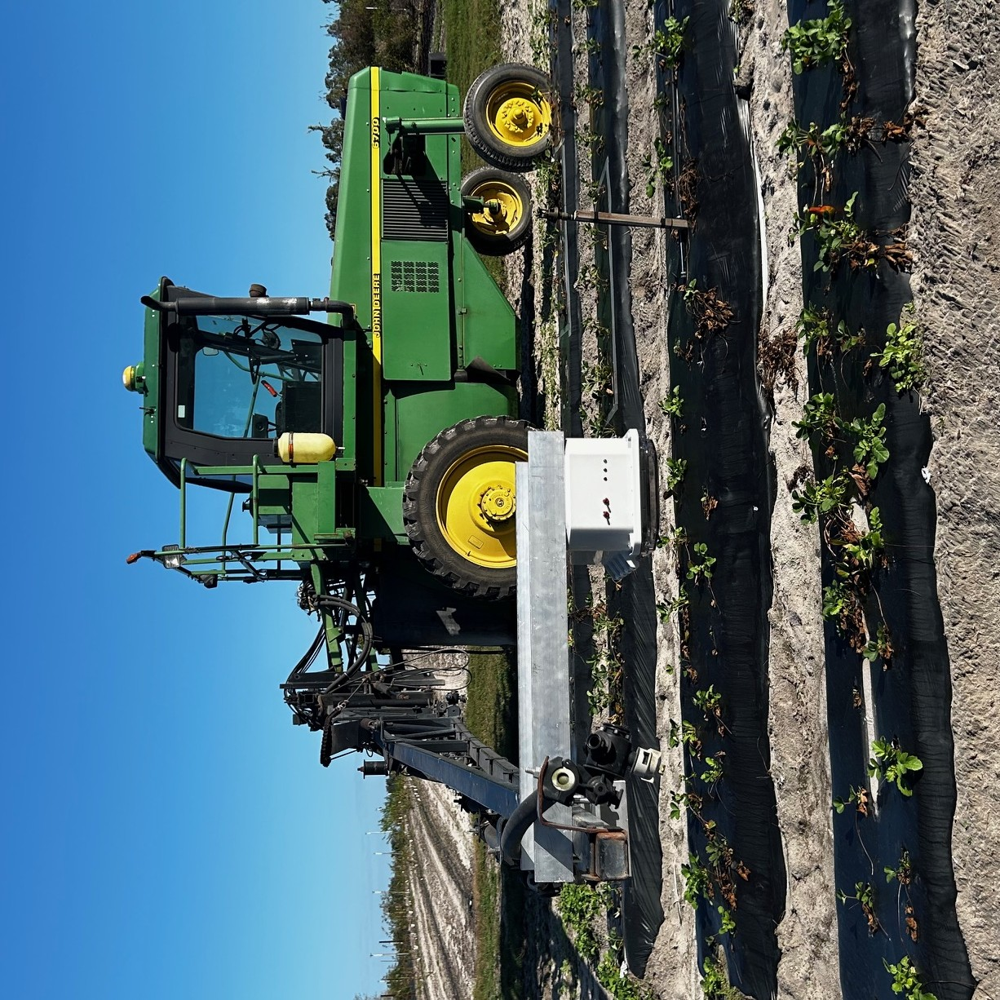

# ABV Agriculture Capture System

ABV Agriculture Capture System is a Jetson Nano camera service for field image capture in agricultural research environments.

## Screenshots



## Tech Stack

- Runtime: Python
- Vision: OpenCV, NanoCamera
- Hardware control: Jetson GPIO
- Platform: Jetson Nano, Linux
- Deployment: systemd services, Bash setup scripts
- Storage: external USB media

## Features

- Startup service for launching the capture workflow automatically.
- Physical switch control for starting and stopping collection.
- RGB status lights for ready, capture, inference, and blocking states.
- 30 FPS image capture to external storage.
- USB mount helper scripts for field storage devices.
- Test scripts for capture and storage behavior.

## Why I Built This

This system was built in collaboration with the UF College of Agriculture and Life Sciences to support strawberry field data collection. The goal was to make image capture reliable enough for a deployed environment where researchers needed physical controls and clear status feedback.

## My Role

I built the Jetson service workflow, hardware control scripts, capture process, storage handling, and setup scripts needed to deploy the system on the device.

## Architecture

- `ABV/main.py` coordinates the device workflow and switch states.
- Storage helpers mount and write image data to external media.
- systemd services start the capture workflow automatically on boot.
- RGB status lights expose the current mode without requiring a monitor or terminal.

## Hard Parts

- Making the system understandable in the field with only switches and status lights.
- Handling startup, USB storage, and capture state safely on a constrained edge device.
- Coordinating hardware state and software state without creating ambiguous modes.

## What I Learned

- Field systems need operational clarity as much as code correctness.
- Startup scripts and service dependencies matter when the device must work without a developer present.
- Simple physical feedback can make hardware/software systems much easier to trust.

## Hardware Requirements

- Jetson Nano running JetPack SDK
- USB camera
- External USB storage
- RGB status lights
- Two physical switches

## Setup

Install the Jetson dependencies, then run the service setup scripts:

```bash
chmod +x setup_services.sh
chmod +x start_main_script.sh
chmod +x usb_mount.sh
./setup_services.sh
```

After setup, reboot the Jetson or reconnect the USB storage. The green status light indicates that the system is ready.

## Operating Notes

- Start with both switches off.
- Do not remove the active USB storage device while the system is running.
- Blue status indicates active data collection.
- Red status indicates inference mode.
- Blinking red or blue indicates blocking mode; toggle both switches off to exit.

## Future Improvements

- GPS metadata support.
- Stronger structured logging.
- Clearer systemd dependency ordering.
- More complete automated test workflow.
